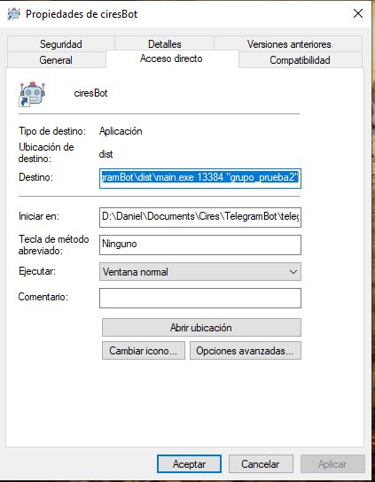

# Telegram ChatBot

Telegram bot to send messages in real time.

## Installation

First create a conda environment from the requiremnts.yaml file located in telegramBot/devtools:

```bash
cd telegramBot/devtools
conda env create --file requirements.yaml
```
Then download the data files and put them in telegramBot/data (create the directory if necessary). 

Now the program can be run from the command line (first go to the directory where main.py is located):

```bash
python main.py 
```
Alternatively an executable file can be created.

## How to create an executable 

First create a conda environment from the requirements.yaml file. Then go to the folder where 
setup.py is located and generate the executable with the following command: 

```bash
python setup.py py2exe
```
A dist directory containing the executable will be created. Copy the following folders into the dist directory: bot, ftp, utils, data, as well as the __init__.py located in telegramBot. You can optionally change the name of the dist directory to something like "TelBot".  

## Passing arguments to the program
The program accepts two arguments which are port number and the name of the telegram group where the 
messages will be send. For example if the program is run from a command line and the desired port is
13385 and the group name is "informacion cires", the following command can be used:

```bash
python main.py 13385 "informacion cires"
```

The casing of the group name doesn't matter.

Alternatively the extra arguments can be passed from a direct access to the executable like in the image:



The default port is 13384 and the default group is grupo_prueba2.

Valid group names are:
- Informacion CIRES
- RACM
- SASMEX
- Grupo_prueba2

## Adding a new bot
To add a new bot, first create a bot in telegram and make sure to turn off group privacy settings for the bot. 
To turnoff privacy setting go to botfather then group settings and finally Group Privacy.

Then, save the token and bot name in the file tokens.txt located in data.

## Adding a new group
To add a new group, first create a group in Telegram Then, add the bot to the group and send a message to the group. Then run the get_groups.py script to get the id of the groups that the bot belongs to:

```bash
python get_groups.py bot_name
```

Copy the name an id of the group and add it to the chats.txt file located in data.


## Telegram Bot Limits

When sending messages inside a particular chat, avoid sending more than one message per second. We may allow short bursts that go over this limit, but eventually you'll begin receiving 429 errors.

If you're sending bulk notifications to multiple users, the API will not allow more than 30 messages per second or so. Consider spreading out notifications over large intervals of 8—12 hours for best results.

Also note that your bot will not be able to send more than 20 messages per minute to the same group.